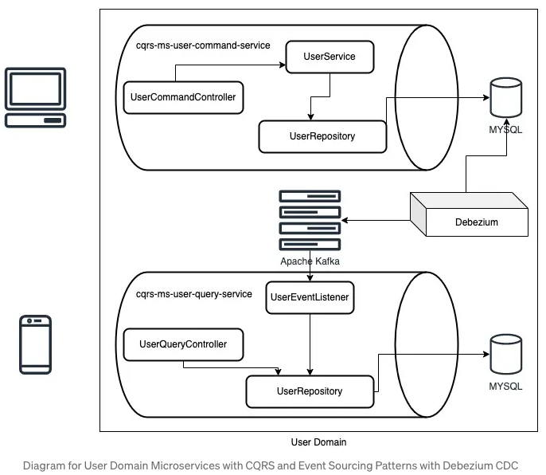

Developing Microservices with CQRS and Event Sourcing Patterns using GraphQL + Spring Boot + Kafka + Debezium (Changelog Data Capture) + PostgreSQL
================================

<p align="center">
  
  <br/>
  <i>* MYSQL changed to PostgreSQL</i>
</p>

# Running Demonstration


Run Commands
------
1. Build the project
```shell
mvn clean install -DskipTests
```
2. Start the services
```shell
docker-compose up --build -d
```
3. Connect Debezium to PostgreSQL
```shell
curl -i -X POST -H "Accept:application/json" -H "Content-Type:application/json" localhost:8083/connectors/ -d '{
    "name": "user-connector",
    "config": {
        "connector.class": "io.debezium.connector.postgresql.PostgresConnector",
        "plugin.name": "pgoutput",
        "tasks.max": "1",
        "database.hostname": "db_write",
        "database.port": "5432",
        "database.user": "postgres",
        "database.password": "postgres123",
        "database.dbname": "user_write_db",
        "database.server.name": "dbserver1",
        "topic.prefix": "dbserver1",
        "table.include.list": "public.cqrs_user"
    }
}'
```
Check the status of the connector
```shell
curl -H "Accept:application/json" localhost:8083/connectors/user-connector
```
#### Topic naming convention
По умолчанию коннектор использует следующую конвенцию `topicPrefix.schemaName.tableName`, где:
- topicPrefix - определяется конфигурацией topic.prefix
- schemaName - название схемы в БД
- tableName - название таблицы
By default, topic name is `dbserver1.public.cqrs_user`

### References
- [Developing Microservices with CQRS and Event Sourcing Patterns using GraphQL + Spring Boot + Kafka](https://shazinsadakath.medium.com/developing-microservices-with-cqrs-and-event-sourcing-patterns-using-graphql-spring-boot-kafka-19f259a7aaa5)
- https://habr.com/ru/articles/779620/
- https://debezium.io/documentation/reference/2.7/connectors/postgresql.html#postgresql-deployment
- https://en.wikipedia.org/wiki/Change_data_capture
- https://habr.com/ru/companies/yandex_cloud_and_infra/articles/754802/
- https://nightlies.apache.org/flink/flink-docs-master/docs/connectors/table/formats/debezium/#debezium-format
- https://habr.com/ru/companies/neoflex/articles/567930/
- https://learn.microsoft.com/en-us/azure/hdinsight-aks/flink/monitor-changes-postgres-table-flink
- https://clickhouse.com/blog/clickhouse-postgresql-change-data-capture-cdc-part-1
- https://www.astera.com/type/blog/change-data-capture-postgresql/
