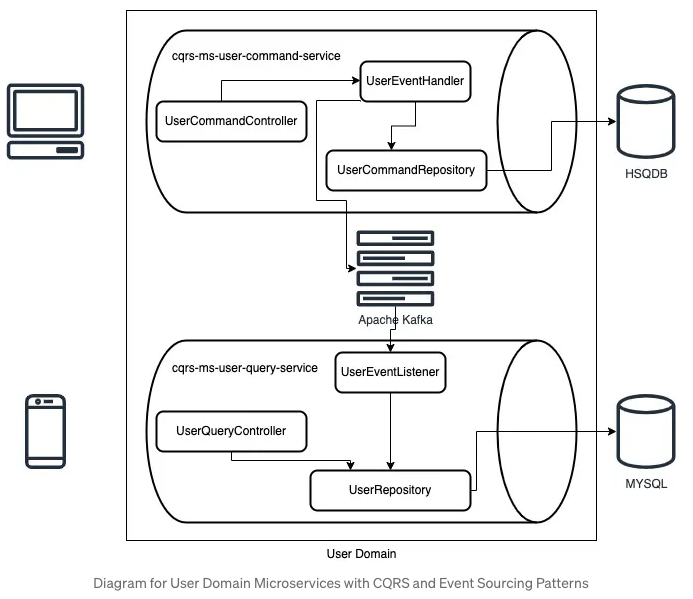

Developing Microservices with CQRS and Event Sourcing Patterns using GraphQL + Spring Boot + Kafka
================================

<p align="center">
  
  <br/>
  <i>* MYSQL changed to PostgreSQL</i>
</p>

# Running Demonstration

Run Commands
------
1. Build the project
```shell
mvn clean install -DskipTests
```
2. Start the services
```shell
docker-compose up --build -d
```

### References
- [Developing Microservices with CQRS and Event Sourcing Patterns using GraphQL + Spring Boot + Kafka](https://shazinsadakath.medium.com/developing-microservices-with-cqrs-and-event-sourcing-patterns-using-graphql-spring-boot-kafka-19f259a7aaa5)
- https://github.com/shazin/cqrs-microservice-demo
- https://learn.microsoft.com/en-us/azure/architecture/patterns/cqrs
- https://learn.microsoft.com/ru-ru/azure/architecture/patterns/cqrs
- https://learn.microsoft.com/en-us/azure/architecture/patterns/event-sourcing
- https://learn.microsoft.com/ru-ru/azure/architecture/patterns/event-sourcing
- https://www.baeldung.com/cqrs-event-sourcing-java
